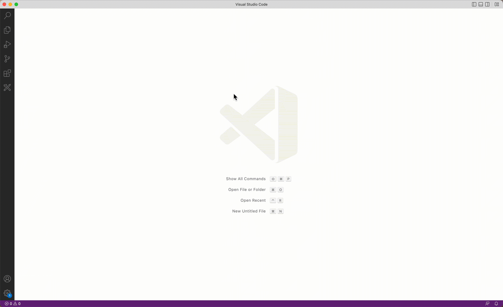

[](https://github.com/SAP/guided-answers-extension/actions/workflows/pipeline.yml?query=branch%3Amain)
[](https://sonarcloud.io/summary/new_code?id=SAP_guided-answers-extension)
[](https://sonarcloud.io/summary/new_code?id=SAP_guided-answers-extension)
[](https://sonarcloud.io/summary/new_code?id=SAP_guided-answers-extension)
[](https://sonarcloud.io/summary/new_code?id=SAP_guided-answers-extension)
[](https://api.reuse.software/info/github.com/SAP/guided-answers-extension)


# Guided Answers extension by SAP
 
A Visual Studio Code extension for accessing SAP's Guided Answers.
<br clear="left"/>
<br/>

## About this project
<kbd></kbd>

Enable community collaboration to jointly promote, develop and consume a VSCode extension which provides a simple interactive way to show the developers how to troubleshoot issues, navigate processes and guide through tasks via the content published to SAP's Guided Answers (https://ga.support.sap.com/dtp/viewer/)


## Development Setup

### Install `pnpm` globally

To install `pnpm` globally using `npm`, run the following:
```shell
npm install -g pnpm
```

More information on pnpm installation options can be found [here](https://pnpm.io/installation).
### Install dependencies
To install `dependencies` and `devDependencies`, run following command at root of the repository:

```shell
pnpm install
```
### Build packages

To transpile the packages, run the following command at the root of the repository or in the individual package:

```shell
pnpm build
```

### Format sources using `prettier`

To format sources, run the following command at the root of the repository or in the individual package:

```shell
pnpm format
```

### Run linting of sources using `eslint`

To run linting of sources, run the following command at the root of the repository or in the individual package:

```shell
pnpm lint
```

To fix linting errors that can be fixed automatically, run the following command at the root of the repository or in the individual package:

```shell
pnpm lint:fix
```

### Run unit tests in packages

To run unit tests using `jest`, run the following command at the root of the repository or in the individual package:

```shell
pnpm test
```
**Note**: if the test run fails due to dependency issues, run `pnpm install && pnpm build` in the root of the repository again to make sure all projects are up-to-date.

### Build extension

To build the `vsix` extension bundle, first change to folder `packages/ide-extension` and run command `pnpm ide-ext:package`:
```shell
cd packages/ide-extension
pnpm ide-ext:package
```

Additional information for developers can be found in the [developer guide](./docs/developer-guide.md).

## Support, Feedback, Contributing

This project is open to feature requests/suggestions, bug reports etc. via [GitHub issues](https://github.com/SAP/guided-answers-extension/issues). Contribution and feedback are encouraged and always welcome. For more information about how to contribute, the project structure, as well as additional contribution information, see our [Contribution Guidelines](CONTRIBUTING.md).

The support for Guided Answers API used in this project has been outlined in [SAP Note 3198105](https://launchpad.support.sap.com/#/notes/3198105).

## Code of Conduct

We as members, contributors, and leaders pledge to make participation in our community a harassment-free experience for everyone. By participating in this project, you agree to abide by its [Code of Conduct](CODE_OF_CONDUCT.md) at all times.

## Licensing

Copyright (2022) SAP SE or an SAP affiliate company and `guided-answers-extension` contributors. Please see our [LICENSE](LICENSE) for copyright and license information. Detailed information including third-party components and their licensing/copyright information is available [via the REUSE tool](https://api.reuse.software/info/github.com/SAP/guided-answers-extension).


## Download & Installation

The Guided Answers Extension Will be available for download via the VSCode Marketplace. It will also be available for download for SAP Business Application Studio.


## Limitations

Users are currently unable to filter the Guided Answers on Products or Components. Will be supported in future releases.

## Known Issues

https://github.com/SAP/guided-answers-extension/issues?q=is%3Aopen+is%3Aissue+label%3Abug
