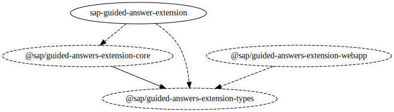

# Technical Information

## Used Technologies

All modules in this repository use [TypeScript](https://www.typescriptlang.org) as programming language. User interfaces (UI) are developed in [React](https://reactjs.org) with [Redux](https://redux.js.org) as state container. The test framework used for unit tests is [jest](https://jestjs.io).

## Modules and Dependencies

In this repository you will find multiple modules. As of now, all modules except [`sap-guided-answer-extension`](../packages/ide-extension/) are private and not published. Following figure shows the modules with their dependency graph.



### Module `sap-guided-answer-extension` ([packages/ide-extension](../packages/ide-extension/))

This is the main module that provides the Visual Studio code extension 'Guided Answers by SAP', which is published to the [Visual Studio Code Marketplace](https://marketplace.visualstudio.com/vscode).

Here are some characteristics of the module
- provides the required setting for Visual Studio Code extensions, e.g. `contributes` section the in the [`package.json`](../packages/ide-extension/package.json)
- hosts the command to start Guided Answers extension
- hosts the webview panel that loads the UI from module [`@sap/guided-answers-extension-webapp`](../packages/webapp/)
- listens to messages/actions from UI and handles or dispatches them
- uses module [`@sap/guided-answers-extension-core`](../packages/core/) to communicate with the Guided Answers REST API

Command `SAP: Open Guided Answers` is registered to start the main screen which allows to search for Guided Answers. There is also a possibility to programmatically start Guided Answers from another extension with a particular Guided Answers tree id, or a complete path to a node, e.g.

```typescript
import { commands } from 'vscode';

// (1) Call Guided Answers with a tree
commands.executeCommand('sap.ux.guidedAnswer.openGuidedAnswer', { treeId: 3046 });

// (2) Call Guided Answers with a tree and node path
commands.executeCommand('sap.ux.guidedAnswer.openGuidedAnswer', { treeId: 3046, nodeIdPath: [45995, 45996, 46000] });
```

The tree id can be captured from the Guide Answer's guide URL, e.g.:   
`https://ga.support.sap.com/dtp/viewer/index.html#/tree/`**3046**`/actions/45995`.

The first example will immediately show the Guided Answer tree 3046 and the first node 45995, the second example will navigate to a path including four steps, like: 
https://ga.support.sap.com/dtp/viewer/index.html#/tree/3046/actions/45995:45996:45999:46000

### Module `@sap/guided-answers-extension-core` ([packages/core](../packages/core/)) 

This module provides a client to communicate with the Guided Answers REST API. 

Characteristics include
- search for Guided Answers trees
- load Guided Answers nodes
- apply enhancements

### Module `@sap/guided-answers-extension-webapp` ([packages/webapp](../packages/webapp/))

The UI part is developed using React. As state container we use Redux. Communication between webapp UI and ide extension is done within a middleware and uses iframe `postMessage()` calls. As control library Microsoft's module `@vscode/webview-ui-toolkit` is used, which also provides controls as React elements.

This module is responsible to 

- show content of Guided Answers trees and nodes as HTML
- provide navigation possibilities
- provide Guided Answers trees search form and list

### Module `@sap/guided-answers-extension-types` ([packages/types](../packages/types/))

The types module provides types that are used across modules. Among others, these include
- action types used for communication between webapp UI and ide-extension
- types for Guided Answers REST API


